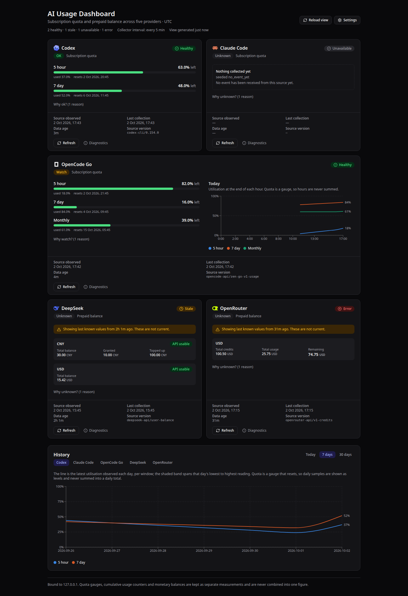

# AI Usage Dashboard

A localhost-first dashboard that answers three questions on one screen: how much
subscription quota is left, how much prepaid credit is left, and whether any
provider is worth switching away from right now.



_Illustrative screenshot using seeded demo data._

Supported providers, with quota and money kept separate:

| Provider        | Source                                                 | Measures                                    |
| --------------- | ------------------------------------------------------ | ------------------------------------------- |
| **Codex**       | Codex CLI interface                                    | quota gauge per window                      |
| **Claude Code** | status-line bridge → local spool; optional quota probe | quota gauge per window                      |
| **OpenCode Go** | OpenCode Go usage API                                  | quota gauge per window                      |
| **DeepSeek**    | DeepSeek balance API                                   | money balance per currency                  |
| **OpenRouter**  | OpenRouter credits API                                 | money: credits, cumulative usage, remaining |

Source contracts and provider requirements live in the
[implementation plan](docs/plan/ai-usage-dashboard-implementation-plan.md) and
[Setup](docs/operations/setup.md).

## Installation

**Linux** is the supported platform with a managed, one-command installation: automatic
collection and start-on-boot use a user `systemd` session. On **macOS**, manual
installations get per-user `launchd` LaunchAgents that run the collector every five minutes
and, with `--with-web`, the loopback dashboard during the login session
([Setup §5](docs/operations/setup.md#5-scheduled-collection)). Native technical lifecycle
checks passed on macOS 15 ARM64 on 2026-10-07; sleep/wake, logout/login, Login Items, and
keyring-credential checks remain user-assisted and unperformed, so macOS support is not yet
fully validated (tracked in
[#29](https://github.com/baktiaditya/ai-usage-dashboard/issues/29)). Windows is not
supported.

### Managed installation (Linux, one command)

The managed installer provisions the dashboard under your home directory: a private,
checksum-verified Node and Corepack runtime, the pnpm version the release pins, detached
release checkouts, and hardened user systemd units. It leaves your default Node, nvm
configuration, shell profiles, global packages, and unrelated units untouched, and it never
takes over a manual or maintainer checkout.

The one-line command pins the release tag that also provides the script, because the
bootstrap and the lifecycle manager it hands off to come from the same commit:

```bash
curl -fsSL https://raw.githubusercontent.com/baktiaditya/ai-usage-dashboard/v0.2.0/scripts/install.sh \
  | bash -s -- --version v0.2.0
```

To read the script before running it, run the same script from a checkout instead:

```bash
git clone https://github.com/baktiaditya/ai-usage-dashboard.git
cd ai-usage-dashboard
bash scripts/install.sh
```

The installer resolves the highest stable release reachable from `main`, or the exact
`--version vX.Y.Z` you name, reports the tag and commit, installs and health-checks the units,
runs one collection, and prints the loopback URL. Provider accounts are not needed: keys are
entered later in Settings, and Codex stays with the Codex CLI.

Starting at boot and surviving logout stay opt-in. Add `--enable-linger`, or run
`loginctl enable-linger "$USER"` yourself; the installer reports the current state either way.

The installer writes a launcher to `~/.local/bin/ai-usage-dashboard`:

```bash
ai-usage-dashboard status                 # paths, version, units, linger, bridge, recovery
ai-usage-dashboard update [--version vX.Y.Z] [--dry-run]
ai-usage-dashboard uninstall [--dry-run]  # keeps data, credentials, backups, and settings
ai-usage-dashboard claude-statusline [existing status-line installer flags]
```

`update` stages the candidate and rebuilds before any downtime, takes a verified database
backup after writers stop, and restores the previous release and database if the candidate
fails. `uninstall` removes only execution surfaces this installation owns and keeps
application data, saved keys, `collector.env`, the data ownership record, and your linger
setting, so reinstalling from the same root reuses the database. If `~/.local/bin` is not on
your `PATH`, use the full launcher path the installer prints; no shell profile is edited.

Managed paths, recovery, configuration, refusal rules, and platform limits are in
[Setup §12](docs/operations/setup.md#12-managed-installation-linux-one-command). Keep the
[production checkout](docs/operations/production-checkout.md) separate: managed commands
never target it.

### Manual installation

Prefer the managed route above. These steps remain supported for development and for
installing from a checkout you manage yourself.

#### Requirements

- Git.
- Node.js from the release line in [.nvmrc](.nvmrc). Other majors are not supported; the exact
  range is `engines.node` in [package.json](package.json). Corepack, bundled with that Node,
  runs the pnpm version pinned by `packageManager`. The managed installer provisions all of
  this privately, so a manual installation is only needed when you want to manage the
  toolchain yourself.
- For each provider you want to see:
  - the Codex CLI, signed in;
  - Claude Code;
  - an API key for DeepSeek, OpenRouter (a _Management_ key), or OpenCode Go.

  None of these is needed to install. A key-based provider or Claude Code that you have not
  set up shows as `unavailable` with a setup hint, and so does Codex when no `codex` is on
  `PATH`.

#### 1. Get the code and toolchain

```bash
git clone https://github.com/baktiaditya/ai-usage-dashboard.git
cd ai-usage-dashboard
nvm install            # reads .nvmrc; or install that Node release another way
corepack enable pnpm   # once per Node installation
```

#### 2. Install, collect once, and start

```bash
pnpm install --frozen-lockfile
pnpm run db:migrate    # creates the database and prints where it lives
pnpm run collect       # one collection pass
pnpm run build
pnpm run start
```

Open the local URL that `pnpm run start` prints. The server binds to loopback only.
`pnpm run collect` exits `1` when any provider errored. A provider you have not set up, including
Codex without its CLI, is `unavailable` rather than an error. Every other provider's result is
still saved, so a fresh install can continue past a failure.

#### 3. Connect your providers

- **Codex:** sign in to the Codex CLI with `codex login`. The dashboard reads quota through the CLI
  and has nothing to configure. `codex` must be on `PATH` in the shell that runs the collector
  or the systemd installer; a CLI installed under a different nvm Node version is not found
  ([Setup §2](docs/operations/setup.md#2-codex)).
- **Claude Code:** run `pnpm run claude:install-statusline` to preview the change, then run it
  again with `--apply`. Start a Claude Code session and send one prompt. An optional quota probe
  reads quota while no session runs, but it sends real inference that counts toward your
  subscription ([Setup §3](docs/operations/setup.md#3-claude-code)).
- **DeepSeek, OpenRouter, OpenCode Go:** open **Settings** in the dashboard, paste the key, and
  select **Save** ([Setup §4](docs/operations/setup.md#4-deepseek-openrouter-and-opencode-go)).

Then select **Refresh** on a card to collect it right away.

#### 4. Keep it running (Linux)

Stop `pnpm run start` first (Ctrl+C), because the installer will not start the web unit while
another process holds its port. Then install the collector timer and the web unit from the
same checkout:

```bash
scripts/install-systemd.sh --install --enable --with-web
loginctl enable-linger "$USER"   # keep running after logout, and start at boot
scripts/install-systemd.sh --status
```

Run `scripts/install-systemd.sh` with no flags to render the units for reading without
installing anything. Interval, port, data directory, and other overrides are in the
[configuration reference](docs/operations/setup.md#7-configuration-reference). Re-run the
installer after changing the interval, port, or data directory, because the units keep the
values they were installed with.

#### Keep it running (macOS)

On macOS, the same checkout installs per-user LaunchAgents; `--with-web` needs
`pnpm run build` first:

```bash
scripts/install-launchd.sh --install --enable --with-web
scripts/install-launchd.sh --status
```

The agents run only while you are logged in, have no systemd sandbox, and log to
`~/Library/Logs/ai-usage-dashboard/`. `scripts/install-launchd.sh --disable --with-web`
stops and disables both. Differences from systemd, including sleep and restart behavior,
are in [Setup §5](docs/operations/setup.md#5-scheduled-collection).

#### Update

```bash
pnpm run db:backup                 # optional safety copy
git pull
pnpm install --frozen-lockfile
pnpm run build
scripts/install-systemd.sh --install --enable --with-web
```

Re-running the installer also restarts the web unit on the new build. Database migrations apply
automatically when the collector or the server next opens the database. To keep a separate
checkout with rollback, follow [Production checkout](docs/operations/production-checkout.md).
On macOS, re-run `scripts/install-launchd.sh --install --enable --with-web` after `pnpm run
build` instead.

#### Uninstall

`scripts/install-systemd.sh --disable --with-web` stops and disables both units. Data lives
outside the repository, by default under `~/.local/share/ai-usage-dashboard/`. The Claude
status-line bridge has its own removal step ([Setup §3](docs/operations/setup.md#remove)).
On macOS, `scripts/install-launchd.sh --disable --with-web` stops and disables both agents;
delete the two `io.github.baktiaditya.ai-usage-dashboard.*.plist` files from
`~/Library/LaunchAgents` to remove them completely.

### Developing

`pnpm run dev` uses a separate port and database, and `pnpm run seed:dev` fills that database
with demo data. See [Development server](docs/operations/setup.md#development-server) and
[CONTRIBUTING.md](CONTRIBUTING.md).

Full instructions, including the Claude status-line bridge, credentials, backup and restore,
and the scheduler units: **[docs/operations/setup.md](docs/operations/setup.md)**.

## The three ideas this is built around

**A quota gauge, a cumulative counter, and a money balance are not the same
number.** A quota window resets to zero; `total_usage` only rises; a balance
moves on top-ups as well as spend. They are separate types end to end — in the
adapters, the schema, the queries and the UI — so nothing can sum them,
average them, or render them through the same component by accident. It also
means DeepSeek's balance is never called "usage": that endpoint reports no usage
at all, and inferring it from a falling balance would be a fabricated number.

**Money keeps its decimal precision.** Amounts are canonical decimal strings,
calculated with decimal arithmetic and stored without floating-point columns.
A chart converts an amount to a number only to position it, and draws nothing
when that number would not read back as the same decimal. Numeric JSON values
are read losslessly, preserving the literal digits from the wire before arithmetic.

**Freshness is derived, never stored.** Card status, data age and advisories all
depend on the current clock and on configurable thresholds, so a persisted copy
would be wrong the moment either moved. They are computed at query time from
immutable observations. The consequence that matters: **a card that is not
`healthy` always yields an `unknown` advisory** — a "switch providers" verdict
computed from a two-day-old percentage is a guess wearing the costume of a fact.

## Architecture

```
Scheduled collection ─┐
                      ├─ Shared collector ── Provider APIs, CLI interfaces, local events
Manual refresh ───────┘          │
                                ▼
                       SQLite observations + attempt audit
                                │
                                ▼
                       Overview and history queries
                       freshness · advisory · aggregation by metric type
                                │
                                ▼
                       Loopback-only dashboard
```

One idempotent collection path serves both the systemd timer and manual refresh,
so scheduled and manual runs cannot drift apart in behaviour.

## Security posture

- binds only to loopback; a non-loopback `AUD_HOST` fails at startup;
- authentication is delegated to the source: no auth file is read, no token is
  extracted, no terminal UI is scraped. The one token the dashboard holds for a
  CLI provider is a Claude token the user mints with `claude setup-token` and
  pastes into Settings to opt into the quota probe;
- adapters select an allowlist at the boundary and discard the raw payload —
  account IDs, emails, session IDs and transcript paths are never persisted;
- a redaction pass runs before every log write, persisted diagnostic, API
  response and rendered string, with tests asserting on each secret shape;
- manual refresh is `POST`, same-origin enforced, and locally rate limited;
- saved credentials live in the owner-only database, are never read from the environment, and never
  reach the browser in full: it receives at most a key's last four characters,
  and every settings route requires a same-origin request;
- read-only toward providers: no plan change, no purchase, and no key is ever
  created, modified, or deleted at a provider. Saving or removing a key in
  Settings changes only the dashboard's local copy.

Credential storage, backup handling, and the quota probe's subscription usage are
covered in [SECURITY.md](SECURITY.md).

## Commands

Run `pnpm run` to list the scripts available in your checkout. Their definitions live in
[package.json](package.json).

For collection, credentials, scheduling, backup, and restore commands, follow
[Setup](docs/operations/setup.md). For development and validation commands, follow
[CONTRIBUTING.md](CONTRIBUTING.md).

## Affiliation and interface stability

This project is not affiliated with, endorsed by, or sponsored by the providers it supports.
Provider names and marks belong to their respective owners and are shown
only to identify the services the dashboard reads; see
[THIRD_PARTY_NOTICES.md](THIRD_PARTY_NOTICES.md).

CLI protocols, status-line payloads, and undocumented usage interfaces can change without
notice. Adapters validate the fields they consume and report unsupported formats as errors.
The [implementation plan](docs/plan/ai-usage-dashboard-implementation-plan.md) describes the
source contracts and fallback behavior.

## Contributing and license

Contributions are welcome; see [CONTRIBUTING.md](CONTRIBUTING.md) for setup, the `pnpm run verify`
gate, and how to add a provider. Report vulnerabilities privately as described in
[SECURITY.md](SECURITY.md). Released under the [MIT License](LICENSE).

## Compatibility and verification

Provider requirements are documented in [Setup](docs/operations/setup.md). Dated live
verification, tested CLI versions, and known limitations are recorded in
[Discovery](docs/discovery/m0-discovery.md), alongside the distinction between live and
fixture evidence. These are observations from their recorded dates.

To check your own installation, follow [Verification](docs/operations/setup.md#9-verification).
Live checks are opt-in and use your configured provider credentials.

Design rationale and scope: [docs/plan/ai-usage-dashboard-implementation-plan.md](docs/plan/ai-usage-dashboard-implementation-plan.md).
Knowledge bundle root: [docs/index.md](docs/index.md).
